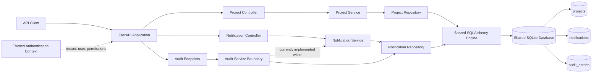

# TaskBridge Architecture

The FastAPI application exposes Project, Notification, and Audit APIs. All use the shared SQLAlchemy engine configured by `DATABASE_URL`, which defaults to `sqlite:///./taskbridge.db`.

Project, Notification, and Audit data use the same database engine and database file. Audit is shown as a separate logical responsibility; its current service methods and repository operations are implemented alongside Notification functionality. Project CRUD does not currently publish events directly to Notification or Audit services.
